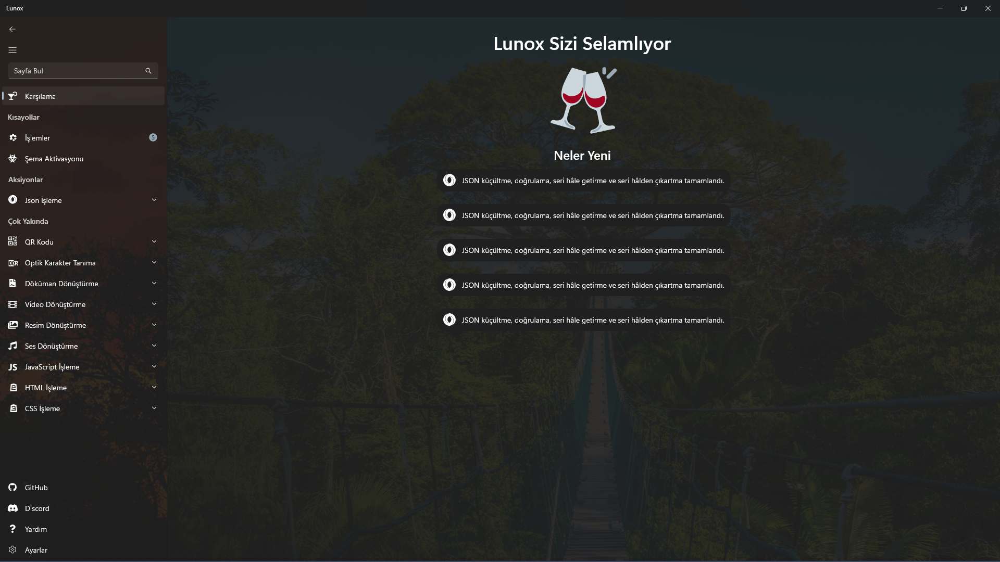
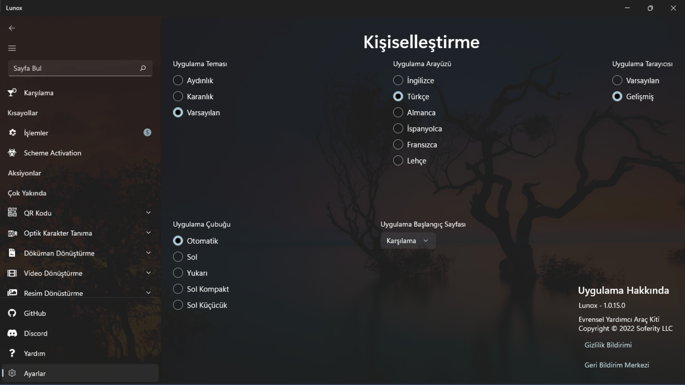
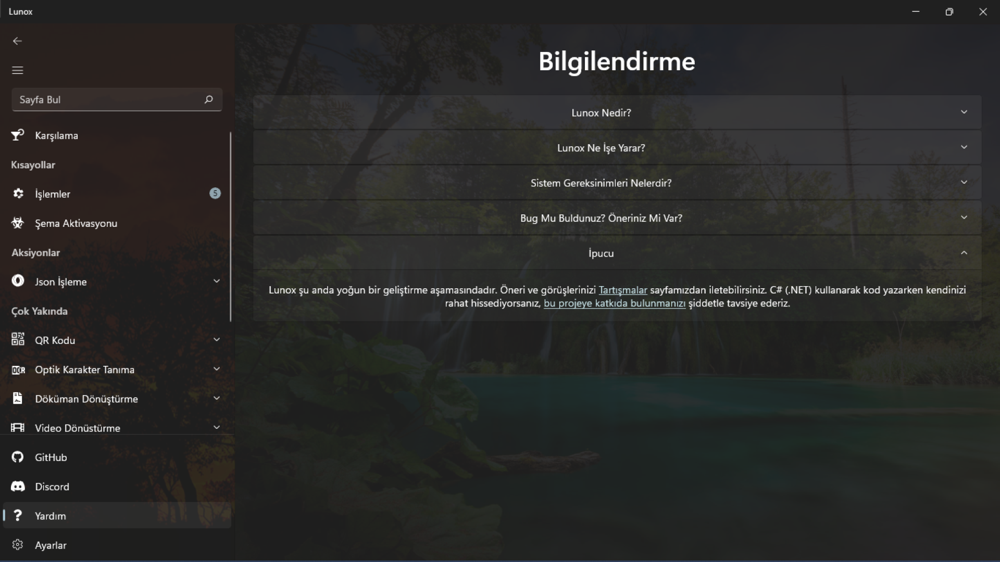
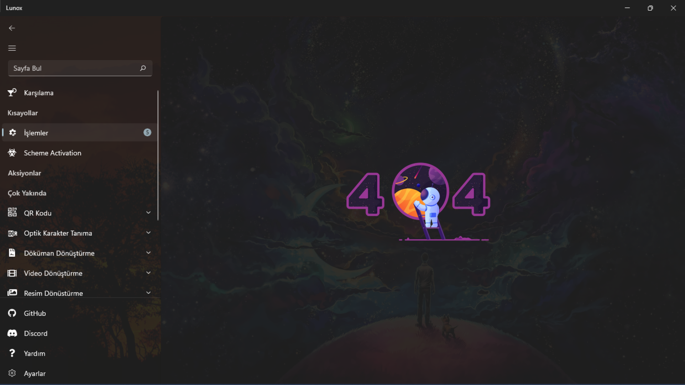

  

  <b>Lunox</b> özelleştirilebilir, modern ve gelişmiş bir Evrensel Yardımcı Araç Kitidir.

<h4 align="center">
  <a href="https://github.com/Soferity/Lunox/issues">Sorunlar</a>
  •
  <a href="https://github.com/Soferity/Lunox/discussions">Tartışmalar</a>
  •
  <a href="https://github.com/Soferity/Lunox/wiki">Dökümantasyon</a>
  •
  <a href="https://discord.gg/nxG977byXb">Discord</a>
</h4>

  
  
  
  
  
  

  
  
  
  

  
  

  
  

  
  

  

  
  

  <!--
  
  
  
  
  
  -->

---

# Lunox Nedir?

  
Daha Fazla Ekran Görüntüsü Görüntüle

  
  
  

Lunox sunduğu çeşitli altyapısı ile birim dönüşümleri, dosya dönüşümleri, OCR işlemleri, QR işlemleri, HTML-CSS-JS-JSON işlemleri ve daha bir çok önde gelen işlemleri kolaylıkla yapmanıza olanak sağlar. Özetle bazı Lunox özellikleri şunlardır:

-   Modern görünüm
-   Çok çeşitli
-   Özelleştirilebilir
-   Kolay kullanım
-   En önemlisi, Açık Kaynaklı Yazılımdır (OSS)!

Lunox şu anda yoğun bir geliştirme aşamasındadır. Öneri ve görüşlerinizi [Tartışmalar](https://github.com/Soferity/Lunox/discussions) sayfamızdan iletebilirsiniz. C# (.NET) kullanarak kod yazarken kendinizi rahat hissediyorsanız, [bu projeye katkıda bulunmanızı](https://github.com/Soferity/Lunox/graphs/contributors) şiddetle tavsiye ederiz.

---

## Sistem Gereksinimleri

- **Windows 11**
- **Windows 10 1809 ve üzeri**

---

## Kurulum

Lunox, [Microsoft Store](https://www.microsoft.com/store/apps/9PC06S6LW868), [GitHub](https://github.com/Soferity/Lunox/releases/latest) üzerinden yüklenebilir.

Yukarıda belirtilen tüm dağıtım yöntemleri desteklenir, ancak kurulumu daha kolay olduğu ve otomatik olarak güncel kalacağı için uygulamanın **Microsoft Store**'dan yüklenmesi **önerilir**.

**Microsoft Store**

**GitHub**

**Windows Güvenilmeyen Uygulama hakkında bilgi isterse**

* MSIX'e sağ tıklayın ve Özellikler'e tıklayın
* Dijital İmzalar sekmesini açın
* Taiizor(BAEB534D-BC36-4432-8EEF-E0088D896FB9)'u seçin ve Ayrıntılar'a tıklayın
* Açılan pencereden Sertifikayı Göster'e tıklayın
* Açılan pencereden Sertifika Yükle'ye tıklayın
* Açılan pencereden Yerel Makine'yi seçin (Kullanıcı Hesabı Denetimi görüntülenirse Evet'e tıklayın)
* Tüm sertifikaları aşağıdaki depolama alanına yerleştir'i seçin ve Gözat'a tıklayın, Güvenilir Kişiler'i seçin ve Tamam'a tıklayın. Ardından Sonraki'ne ve Son'a tıklayın
* Tamam'a tıklayın
* Bundan sonra onay pencereleri görünecektir, MSIXBUNDLE'yi Yüklemeyi Deneyin

---